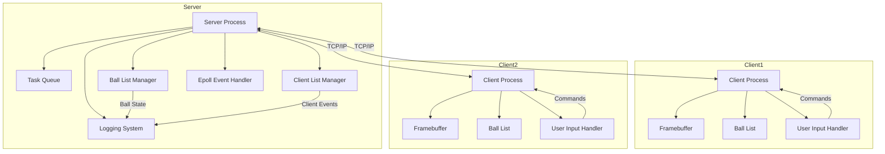
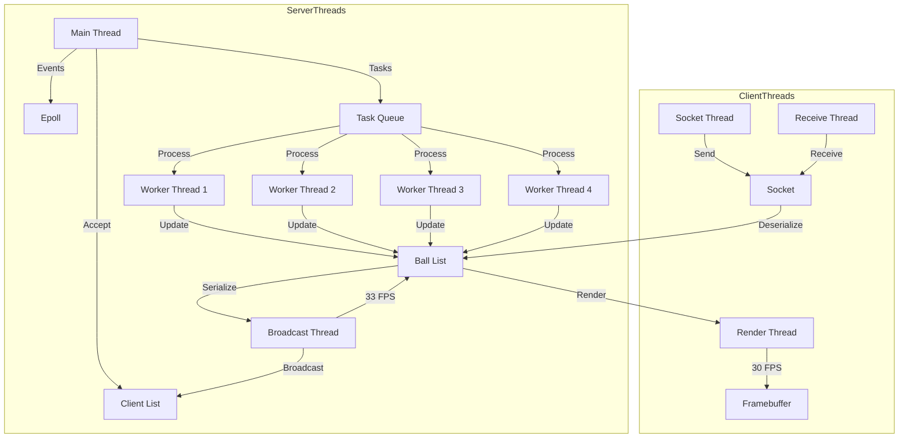
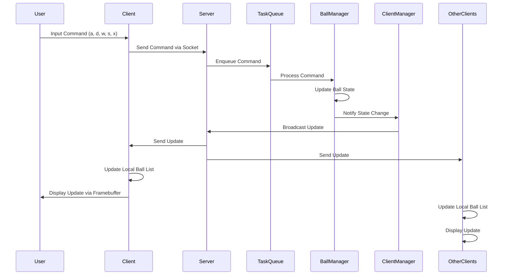
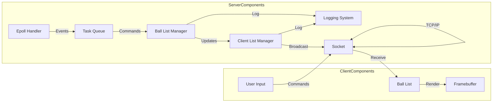
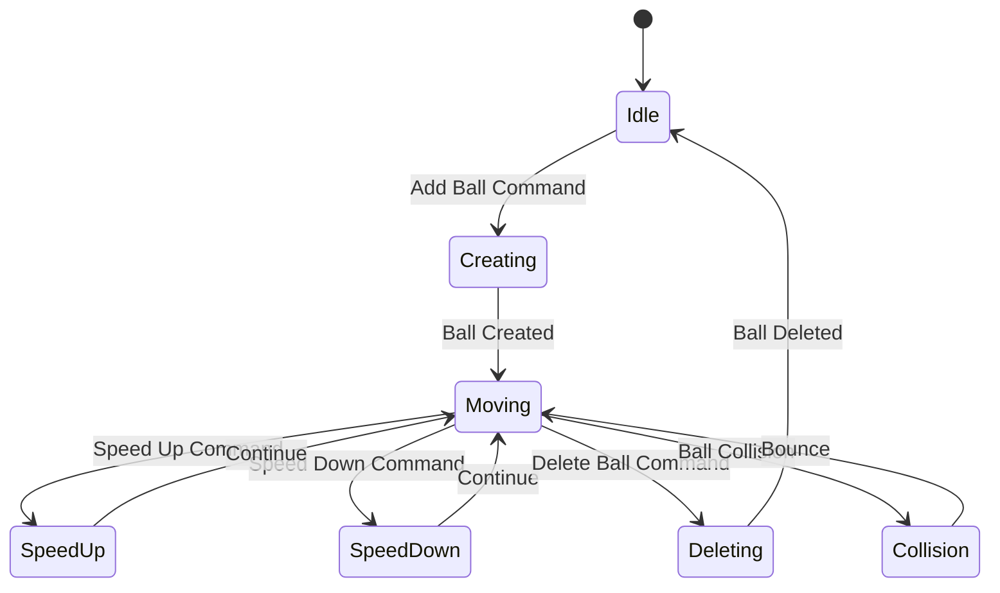

# Ball Game Project

A real-time multiplayer ball game system that allows clients to create, manipulate, and view animated balls on a shared display using Linux framebuffer.

## Technology Stack

- **Language**: C
- **Build System**: Make
- **Key Libraries**:
  - POSIX Threads (pthread)
  - Linux Framebuffer
  - Socket Programming (BSD sockets)
  - epoll for event handling

## System Architecture

### High-Level Architecture

The system follows a client-server architecture with the following components:

1. **Server**

   - Manages ball states and client connections
   - Handles ball creation, deletion, and movement
   - Broadcasts ball state updates to all connected clients
   - Uses epoll for efficient event handling
   - Implements a task queue for command processing

2. **Client**

   - Connects to the server
   - Renders balls on the Linux framebuffer
   - Handles user input for ball manipulation
   - Receives and displays ball state updates
   - Uses multiple threads for concurrent operations

3. **Test Client**
   - Provides automated testing capabilities
   - Simulates client behavior for testing

### Architecture Diagrams

#### System Overview



#### Thread Model



#### Data Flow



#### Component Interaction



#### Ball State Management



### Component Details

#### Server Components

1. **Task Queue System**

   - Manages incoming client commands asynchronously
   - Implements thread-safe queue operations
   - Supports multiple worker threads for parallel processing

2. **Ball List Manager**

   - Maintains the authoritative state of all balls
   - Handles ball creation, deletion, and movement
   - Implements thread-safe operations with mutex protection
   - Manages ball properties (position, radius, speed)

3. **Client List Manager**

   - Tracks all connected clients
   - Manages client connections and disconnections
   - Handles client authentication and session management
   - Implements thread-safe client list operations

4. **Event Handling System**
   - Uses epoll for efficient I/O event handling
   - Manages multiple client connections
   - Handles socket events asynchronously

#### Client Components

1. **Framebuffer Manager**

   - Controls direct display output
   - Handles screen buffer management
   - Implements efficient drawing operations
   - Manages display resolution and color depth

2. **Ball List Manager**

   - Maintains local copy of ball states
   - Implements thread-safe operations
   - Handles ball state updates from server
   - Manages ball rendering properties

3. **Socket Communication**
   - Handles bidirectional communication with server
   - Implements reliable data transmission
   - Manages connection state
   - Handles reconnection logic

### Thread Model

#### Server Threads

1. **Main Thread**

   - Accepts new client connections
   - Manages epoll event loop
   - Coordinates worker threads
   - Handles server shutdown

2. **Worker Threads (4 threads)**

   - Process client commands from task queue
   - Update ball states
   - Handle ball creation/deletion
   - Manage ball movement and collisions

3. **Broadcast Thread**
   - Periodically sends ball state updates (33 FPS)
   - Serializes ball data for transmission
   - Handles client disconnections
   - Manages broadcast queue

#### Client Threads

1. **Render Thread**

   - Updates display at 30 FPS
   - Manages framebuffer operations
   - Handles ball animation
   - Implements double buffering

2. **Socket Receive Thread**

   - Receives server updates
   - Deserializes ball data
   - Updates local ball state
   - Handles connection errors

3. **Socket Send Thread**
   - Processes user input
   - Sends commands to server
   - Manages command queue
   - Handles connection state

### Data Flow

1. **Command Flow**:

   ```
   Client Input → Socket Send Thread → Server Socket → Task Queue → Worker Thread → Ball State Update
   ```

2. **State Update Flow**:

   ```
   Ball State Change → Server Broadcast Thread → Client Socket Receive Thread → Ball List Update → Render Thread → Display
   ```

3. **Synchronization Flow**:
   ```
   Mutex Lock → Resource Access → Resource Update → Mutex Unlock
   ```

### Resource Management

1. **Memory Management**

   - Dynamic allocation for ball objects
   - Thread-safe memory operations
   - Proper resource cleanup
   - Memory leak prevention

2. **File Descriptor Management**

   - Efficient socket handling
   - Proper FD cleanup
   - Resource limit management
   - Error handling

3. **Thread Synchronization**
   - Mutex protection for shared resources
   - Thread-safe data structures
   - Deadlock prevention
   - Resource contention management

## Features

- Real-time ball animation
- Multi-client support
- Command-based ball manipulation:
  - Create balls (`a` or `a:<count>`)
  - Delete balls (`d` or `d:<count>`)
  - Speed control (`w` for increase, `s` for decrease)
- Linux framebuffer-based rendering
- Thread-safe operations
- Comprehensive logging system
- Graceful shutdown handling

## Directory Structure

```
ball_game/
├── bin/                    # Compiled executables
├── docs/                   # Documentation
├── include/               # Header files
│   ├── client/           # Client-specific headers
│   ├── server/           # Server-specific headers
│   ├── shared/           # Shared headers
│   └── test_client/      # Test client headers
├── logs/                  # Log files
├── obj/                   # Object files
└── src/                   # Source files
    ├── client/           # Client implementation
    ├── server/           # Server implementation
    ├── shared/           # Shared implementation
    └── test_client/      # Test client implementation
```

## Building and Running

1. Build all components:

   ```bash
   make
   ```

2. Run the server:

   ```bash
   ./bin/server
   ```

3. Run the client:

   ```bash
   ./bin/client
   ```

4. Run the test client:
   ```bash
   ./bin/test_client
   ```

## Command Guide

- Create a ball: `a` or `a:<count>`
- Delete a ball: `d` or `d:<count>`
- Increase speed: `w`
- Decrease speed: `s`
- Exit: `x`
