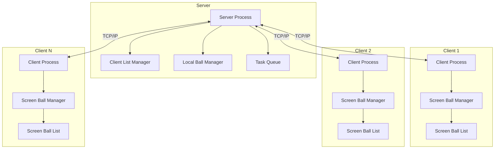
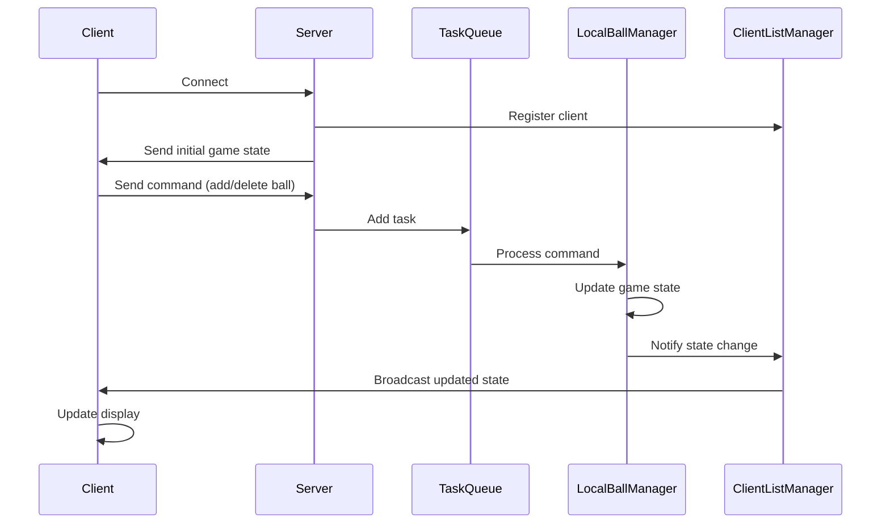
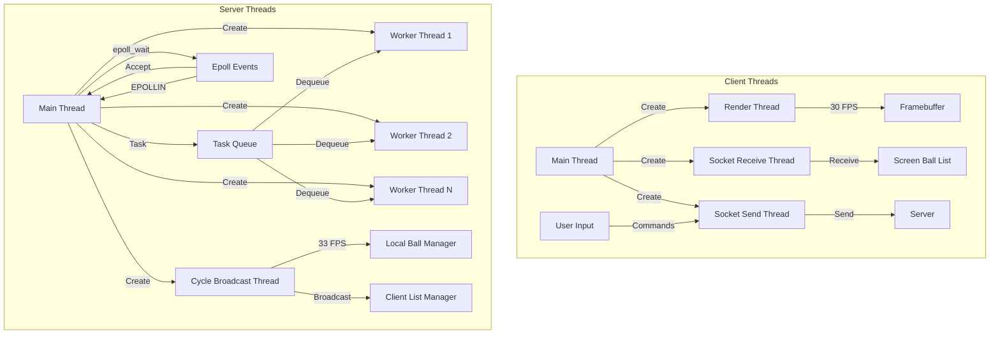
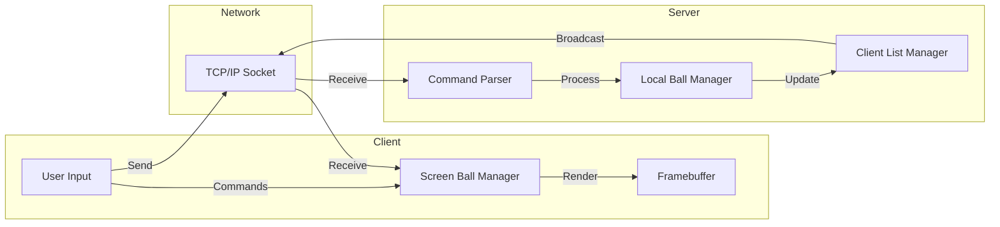

# Ball Game

A client-server based interactive ball game that allows multiple clients to connect to a server and manipulate balls on a shared display.

## Technology Stack

### Programming Language

- **C**: Core implementation language
- **C99 Standard**: Modern C features and syntax

### System Programming

- **Linux System Calls**: For low-level system operations
- **POSIX Threads (pthread)**: For multi-threading support
- **Socket Programming**: For network communication
- **Framebuffer API**: For direct display manipulation

### Network Communication

- **TCP/IP**: For reliable client-server communication
- **Socket API**: For network socket operations
- **Select I/O Multiplexing**: For handling multiple client connections

### Build Tools

- **GCC**: GNU Compiler Collection
- **Make**: Build automation tool
- **GDB**: Debugging tool

### Development Tools

- **Doxygen**: Documentation generation
- **Git**: Version control system
- **Valgrind**: Memory leak detection and profiling

### Libraries

- **Standard C Library**: For basic I/O and data manipulation
- **POSIX Library**: For system-level operations
- **Linux Framebuffer Library**: For display operations

### Operating System

- **Linux**: Primary development and deployment platform
- **Kernel Version**: 5.15.0 or higher recommended

## System Architecture

### High-Level Architecture



### Component Interaction



### Thread Model



### Data Flow



## Project Overview

Ball Game is a networked application that consists of a server and multiple clients. The server manages the game state and coordinates between clients, while each client connects to the server and displays the game on a framebuffer device.

## Architecture

The project is organized into three main components:

### Server Component

- **Server**: Manages client connections and game state
- **Client List Manager**: Handles client connections and disconnections
- **Local Ball Manager**: Manages the ball objects on the server side
- **Task Queue**: Processes client commands asynchronously

### Client Component

- **Client**: Connects to the server and receives game state updates
- **Screen Ball Manager**: Manages the display of balls on the client's screen
- **Screen Ball List**: Maintains a list of balls to be displayed

### Shared Component

- **Framebuffer Drawing**: Provides functions for drawing on the framebuffer
- **Logging**: Handles logging of events and errors
- **Console Color**: Provides colored output for console messages

## Features

- **Multi-client Support**: Multiple clients can connect to the server simultaneously
- **Real-time Updates**: Changes to the game state are broadcast to all connected clients
- **Interactive Ball Manipulation**: Clients can add, delete, and modify balls
- **Framebuffer Display**: Game is displayed directly on the framebuffer device
- **Threaded Architecture**: Uses multiple threads for rendering, sending, and receiving data

## Directory Structure

```
Ball_Game/
├── include/
│   ├── client/
│   │   ├── client.h
│   │   ├── screenball.h
│   │   ├── screenball_list.h
│   │   └── screenballmanager.h
│   ├── server/
│   │   ├── client_list_manager.h
│   │   ├── localball.h
│   │   ├── localball_list.h
│   │   ├── localballmanager.h
│   │   ├── server.h
│   │   └── task.h
│   └── shared/
│       ├── console_color.h
│       ├── fbDraw.h
│       └── log.h
└── src/
    ├── client/
    │   ├── client.c
    │   ├── main.c
    │   ├── screenball.c
    │   ├── screenball_list.c
    │   └── screenballmanager.c
    ├── server/
    │   ├── client_list_manager.c
    │   ├── localballmanager.c
    │   ├── localball_list.c
    │   ├── loaclball.c
    │   ├── main.c
    │   ├── server.c
    │   └── task.c
    └── shared/
        ├── fbDraw.c
        └── log.c
```

## Key Components

### Server

- Manages client connections using sockets
- Processes client commands and updates the game state
- Broadcasts state changes to all connected clients
- Uses a task queue for asynchronous command processing

### Client

- Connects to the server using sockets
- Receives game state updates from the server
- Renders the game state on the framebuffer
- Sends user commands to the server

### Ball Management

- **Server-side**: LocalBallManager maintains the authoritative game state
- **Client-side**: ScreenBallManager displays the game state
- Balls have properties such as position, radius, and color

### Framebuffer Drawing

- Provides low-level drawing functions for the framebuffer
- Supports drawing shapes, lines, and text
- Handles color management and screen updates

## Building and Running

### Prerequisites

- Linux operating system with framebuffer support
- GCC compiler
- Make build system
- pthread library

### Build Instructions

1. Clone the repository
2. Navigate to the project directory
3. Run `make` to build both server and client

### Running the Application

1. Start the server: `./server`
2. Start one or more clients: `./client`

## Author

Kim Hyo Jin

## License

This project is proprietary and confidential.
